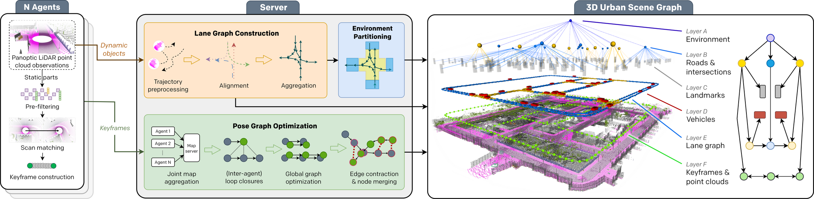
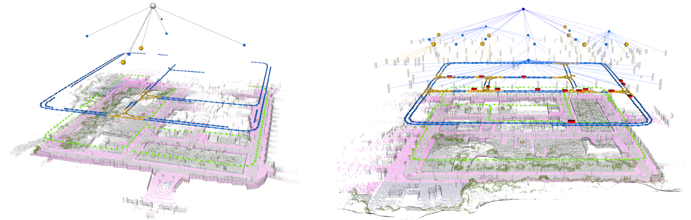

# CURB-SG
[**arXiv**](https://arxiv.org/abs/2309.06635) | [**IEEE Xplore**](https://ieeexplore.ieee.org/document/10610112) | [**Website**](http://curb.cs.uni-freiburg.de/) | [**Video**](https://www.youtube.com/watch?v=qbzQNz7_i8c)

This repository is the official implementation of the paper:

> **Collaborative Dynamic 3D Scene Graphs for Automated Driving**
>
> [Elias Greve]()&ast;, [Martin Büchner](https://rl.uni-freiburg.de/people/buechner)&ast;, [Niclas Vödisch](https://vniclas.github.io/)&ast;, [Wolfram Burgard](https://www.utn.de/person/wolfram-burgard/), and [Abhinav Valada](https://rl.uni-freiburg.de/people/valada). <br>
> &ast;Equal contribution. <br> 
> 
> *IEEE International Conference on Robotics and Automation (ICRA)*, 2024

<p align="center">
  
</p>

If you find our work useful, please consider citing our paper:
```
@inproceedings{greve2024curb,
    title={Collaborative Dynamic 3D Scene Graphs for Automated Driving},
    author={Greve, Elias and Büchner, Martin and Vödisch, Niclas and Burgard, Wolfram and Valada, Abhinav},
    booktitle={IEEE International Conference on Robotics and Automation (ICRA)},
    year={2024},
    pages={11118-11124}
}
```


## 📔 Abstract

Maps have played an indispensable role in enabling safe and automated driving. Although there have been many advances on different fronts ranging from SLAM to semantics, building an actionable hierarchical semantic representation of urban dynamic scenes from multiple agents is still a challenging problem. In this work, we present Collaborative URBan Scene Graphs (CURB-SG) that enable higher-order reasoning and efficient querying for many functions of automated driving. CURB-SG leverages panoptic LiDAR data from multiple agents to build large-scale maps using an effective graph-based collaborative SLAM approach that detects inter-agent loop closures. To semantically decompose the obtained 3D map, we build a lane graph from the paths of ego agents and their panoptic observations of other vehicles. Based on the connectivity of the lane graph, we segregate the environment into intersecting and non-intersecting road areas. Subsequently, we construct a multi-layered scene graph that includes lane information, the position of static landmarks and their assignment to certain map sections, other vehicles observed by the ego agents, and the pose graph from SLAM including 3D panoptic point clouds. We extensively evaluate CURB-SG in urban scenarios using a photorealistic simulator.


## 👩‍💻 Code

### 🏗 Setup

1. Create conda environment: `conda create --name curb python=3.8`
2. Activate environment: `conda activate curb`
3. Install dependencies: `pip install -r requirements.txt`
4. Setup the ros environment:
- set up ROS NOETIC on Ubuntu 20.04: `sudo apt-get install ros-noetic-geodesy ros-noetic-pcl-ros ros-noetic-nmea-msgs ros-noetic-libg2o`
- `sudo apt-get install python3-rospy` 
- `sudo apt-get install ros-noetic-jsk-recognition-msgs`
- `sudo apt-get install ros-noetic-jsk-rviz-plugins`

5. Clone the project and its submodules:
- `git clone --recurse-submodules -j8 https://github.com/robot-learning-freiburg/CURB-SG.git`

- Add to ~/.bashrc:
    ```
    # set PATH so it includes user's private bin if it exists
    if [ -d "$HOME/.local/bin" ] ; then
        PATH="$HOME/.local/bin:$PATH"
    fi
    source /opt/ros/noetic/setup.bash
    export $PYTHONPATH:$PYTHONPATH:/home/$USER/collaborative_panoptic_mapping/
    ```

6. Build the project:
- `cd collaborative_panoptic_mapping/catkin_ws/src`
- `catkin_make -DCMAKE_BUILD_TYPE=RELEASE`

### :rocket: Run 

Each command in a different console to keep the process observable:
- Start Carla simulator `cd /path-to-carla/carla-simulator/ && ./CarlaUE4.sh`
- Start ros core `roscore`
- Start the bride to transmit the sensors of the carla cars into ros messages `python carla_interface/carla2curb.py` (The parameters for the simulation can be set within the python file. It must be restarted to reset the simulation.)

All following commands must be in terminals with a preliminary `source catkin_ws/devel/setup.bash`

- Start the divider node that separates the dynamic classes from the static ones `rosrun hdl_graph_slam pcl_divider_node false` (true to add gaussian noise on all LiDAR points)
- Start the map server: `roslaunch hdl_graph_slam map_server.launch`
- Start the agents: `roslaunch hdl_graph_slam hdl1.launch agent_no:=0` for the next ones 1,2.. (remember to set the correct number of agents in the carla2curb.py file before starting it)
- Start the visualisation: `rviz -d src/hdl_graph_slam/rviz/map.rviz`

All following commands are within the `python_nodes` folder:

- Start the node to compute the lane graph `python node_lane_graph.py`
- Start the node to visualize the observed vehicles on the lane graph `python node_vehicle_on_lanegraph.py`
- Start the node to separate the different semantic layers `python node_layered_map.py`
- Start the node to cluster the detected poles and street signs `python node_cluster_pole`.py`
- Start the node to build the final graph edges `python abstract_graph_edges.py`

For each run, it is crucial to restart all ROS nodes and processes. Additionally, ensure to start the agents in the specified order after the map server has been initiated.


## 🖼️ Sample Data
We provide two rosbags as sample data for download. 

<p align="center">
  
</p>

The first sample data includes the final result of a Carla town simulation, and to view these results, it is sufficient to have the RViz preset active before playing the ROSbag. 
```
wget aisdatasets.cs.uni-freiburg.de/curb-sg/curb-sg-final.bag
```
The second sample data consists of a recorded ROSbag containing the vehicle sensor data necessary to operate the complete system independently of a Carla instance. In this setup, the Carla2Curb interface is not required. Simply play the ROSbag, then initiate the map server, agents, and Python nodes in that order. The outcomes will be visible in RViz.

```
wget aisdatasets.cs.uni-freiburg.de/curb-sg/curb-sg-progress.bag
```


## 👩‍⚖️  License

For academic usage, the code is released under the [GPLv3](https://www.gnu.org/licenses/gpl-3.0.en.html) license.
For any commercial purpose, please contact the authors.


## 🙏 Acknowledgment

We thank Kenji Koide for open-sourcing the ROS package [hdl_graph_slam](https://github.com/koide3/hdl_graph_slam) that we use as base for our multi-agent LiDAR SLAM framework.

This work was funded by the European Union’s Horizon 2020 research and innovation program grant No 871449-OpenDR and the German Research Foundation (DFG) Emmy Noether Program grant No 468878300.
<br><br>
<p float="left">
  <a href="https://opendr.eu/"></a>
  &nbsp;
  &nbsp;
  &nbsp;
  <a href="https://www.dfg.de/en/research_funding/programmes/individual/emmy_noether/index.html"></a>  
</p>

